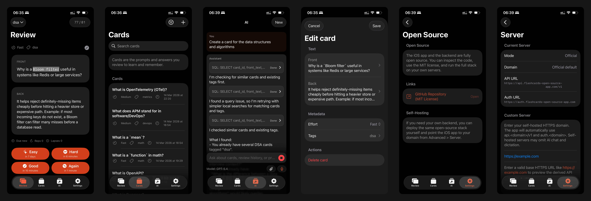

# Flashcards Open Source App

Flashcards are a simple study format: the front side shows a question or prompt, and the back side shows the answer. People use them to study languages, facts, definitions, code, and other material they want to remember. This project is an open-source Anki-like flashcards app focused on iOS, web, and offline-first sync.

Open-source offline-first flashcards app for iOS and web.

## Clients

- iOS app in `apps/ios`
- Web client in `apps/web`
- AI agents support through the external agent API: [https://api.flashcards-open-source-app.com/v1/](https://api.flashcards-open-source-app.com/v1/)
- Android app planned later

## Features

- Offline-first: browser local database on web, SQLite on iOS
- Auto-sync: clients write locally first and sync with the backend when online

## Card scheduling

- Review scheduling uses FSRS-6 with pinned default weights
- The full scheduler is implemented in backend and iOS and must stay behaviorally identical
- The web app mirrors the scheduler data contract and review flow, but does not contain a third FSRS implementation
- Cards appear in review when they are due: `due_at <= now()`
- Detailed scheduling rules live in [`docs/fsrs-scheduling-logic.md`](docs/fsrs-scheduling-logic.md)

## Setup Docs

- [iOS local setup](docs/ios-local-setup.md)
- [Backend and web deployment](docs/backend-web-deployment.md)
- More architecture details: [`docs/architecture.md`](docs/architecture.md)
