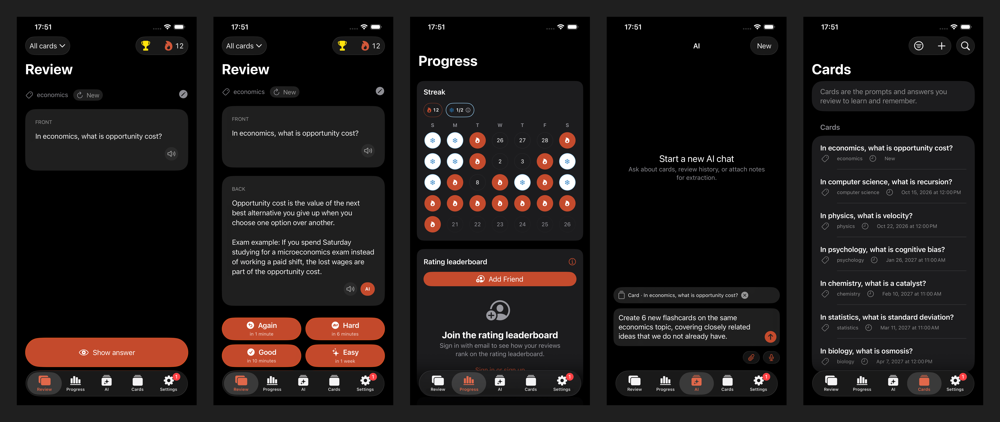

# Flashcards Open Source App

AI-powered open-source flashcards app for iOS, Android, and web.

Flashcards Open Source App is an open-source AI-powered flashcards app built for serious daily study on iOS, Android, and the web. Use it to prepare for exams, learn vocabulary, memorize technical terms and facts, improve your material with AI, and review with spaced repetition. The project also includes an external agent API for terminal and AI-agent workflows.

## Available on

- [iOS](https://apps.apple.com/us/app/flashcards-open-source-app/id6760538964)
- [Android](https://play.google.com/store/apps/details?id=com.flashcardsopensourceapp.app&pcampaignid=web_share)
- [Web](https://app.flashcards-open-source-app.com/review)
- MCP server: https://mcp.flashcards-open-source-app.com/mcp
- Agent API: https://api.flashcards-open-source-app.com/v1/

## Card scheduling

Card scheduling uses FSRS-based spaced repetition. Detailed scheduling rules live in [docs/fsrs-scheduling-logic.md](docs/fsrs-scheduling-logic.md).

## MCP connector

The hosted MCP server is available at `https://mcp.flashcards-open-source-app.com/mcp` and is listed in MCP registries as `com.flashcards-open-source-app/flashcards`. It exposes six workspace-scoped tools: `list_workspaces`, `sql_query`, `sql_execute`, `next_review_card`, `reveal_answer`, and `submit_review`.

The dedicated review tools support one-question-at-a-time conversations and idempotent FSRS scheduling. See [conversational reviews](docs/conversational-reviews.md) for the MCP/Agent API contract and voice-session examples. ChatGPT Voice currently does not invoke apps/MCP; these tools do not remove that external limitation.

Interactive clients authenticate with OAuth 2.1 authorization code + PKCE and Dynamic Client Registration. Headless clients can use an `fca_` Bearer token.

- [MCP connector docs](https://flashcards-open-source-app.com/docs/mcp-connector/)
- [Agent API docs](https://flashcards-open-source-app.com/docs/api/)
- [Privacy](https://flashcards-open-source-app.com/privacy/)
- [Support](https://flashcards-open-source-app.com/support/)

## Docs

- [iOS app](apps/ios/README.md)
- [Android app](apps/android/README.md)
- [Web app](apps/web/README.md)
- [Architecture](docs/architecture.md)
- [Backend and web deployment](docs/backend-web-deployment.md)
- [Public site URLs (`PUBLIC_SITE_BASE_URL`)](docs/public-site-urls.md)
- [Release gates and monitoring](docs/release-gates.md)
- [Manual production release](docs/manual-production-release.md)
- [iOS local setup](docs/ios-local-setup.md)
- [iOS CI/CD](docs/ios-ci-cd.md)
- [Android CI/CD](docs/android-ci-cd.md)
- [Agent API](https://api.flashcards-open-source-app.com/v1/)

## License

This project is licensed under the MIT License - see the [LICENSE](LICENSE) file for details.

## Author

- [Kirill Markin](https://github.com/kirill-markin)
