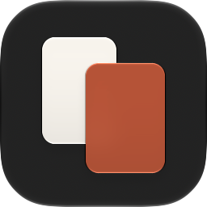
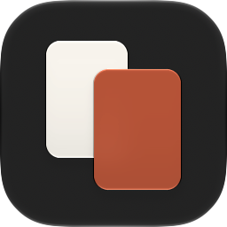
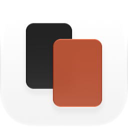

# Apple app icon

Nibomo's iOS icon is a pair of editable Icon Composer documents with the same
two SVG card layers and the same subtle native Liquid Glass settings. Xcode 27
or newer is required to read their refraction and specular-placement
annotations.

- `../Flashcards/Flashcards/AppIcon.icon` is the default dark icon. It stays
  dark in both the Default and Dark Home Screen appearances.
- `../Flashcards/Flashcards/AppIcon-Light.icon` is the light alternate. It
  stays light in both appearances and is not yet registered as an alternate
  app icon.

Colors and glass values live in each document's `icon.json`; both share the
same Clear and Tinted specializations. The canvas uses root
`fill-specializations` with an explicit `dark` entry because a plain root
`fill` falls back to the system background in the Dark appearance.

| Default | Dark | Light alternate |
| --- | --- | --- |
|  |  |  |

`ASSETCATALOG_COMPILER_APPICON_NAME` is `AppIcon`. The app's synchronized
source group includes the `.icon` packages automatically, and Xcode generates
images for earlier systems, including the iOS 18 default, dark, and tinted
icons, from the `.icon` document. The deployment target remains iOS/iPadOS
18.0.

## Verification

Build the app with the current Xcode, then install it on an iPhone and iPad.
Inspect Home Screen Default, Dark, Clear Light/Dark and Tinted Light/Dark at
normal and large icon sizes. Check that both card shapes remain distinct and
the icon stays dark in Default and Dark. Confirm the build generates
older-system images; use an actual supported older OS for device verification.

To export an appearance directly from the native renderer:

```sh
"/Applications/Xcode.app/Contents/Applications/Icon Composer.app/Contents/Executables/ictool" \
  apps/ios/Flashcards/Flashcards/AppIcon.icon \
  --export-image --output-file /tmp/nibomo-icon.png \
  --platform iOS --rendition Default --width 1024 --height 1024 --scale 1 \
  --design-generation 27
```

Use `Dark`, `ClearLight`, `ClearDark`, `TintedLight`, or `TintedDark` for the other
appearances, and `AppIcon-Light.icon` for the light alternate. The previews
above are `Default` and `Dark` of `AppIcon.icon` and `Default` of
`AppIcon-Light.icon` at 256 px. Use `--design-generation 26` to review the
previous rendering; Apple documents that refraction has no visible effect
before OS 27.

References: [Apple's Icon Composer workflow](https://developer.apple.com/documentation/xcode/creating-your-app-icon-using-icon-composer),
[App icon HIG](https://developer.apple.com/design/human-interface-guidelines/app-icons),
[WWDC26 Icon Composer lab](https://developer.apple.com/videos/play/wwdc2026/8012/).
